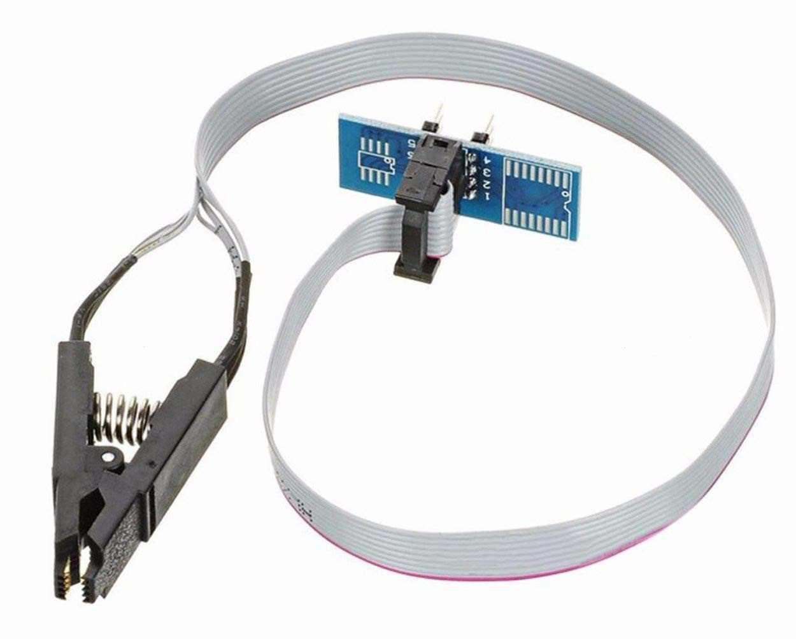
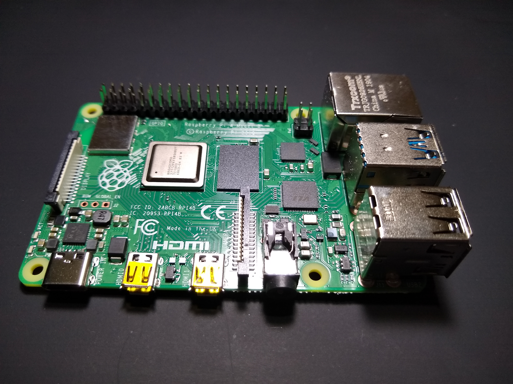
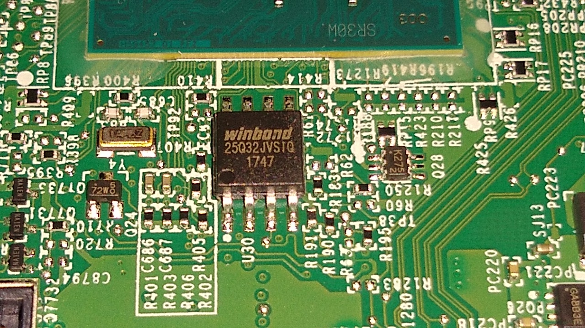
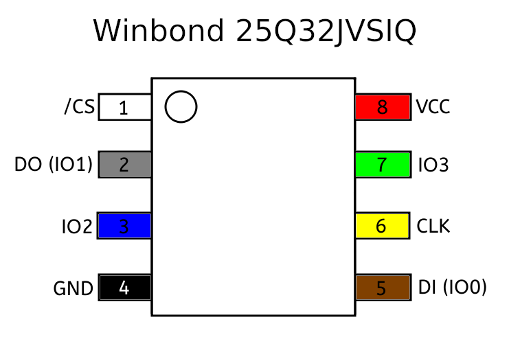
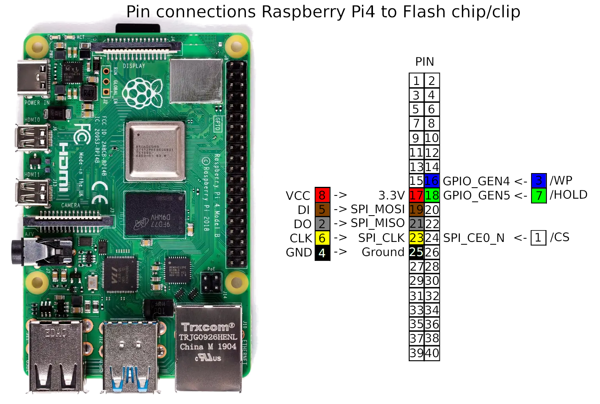
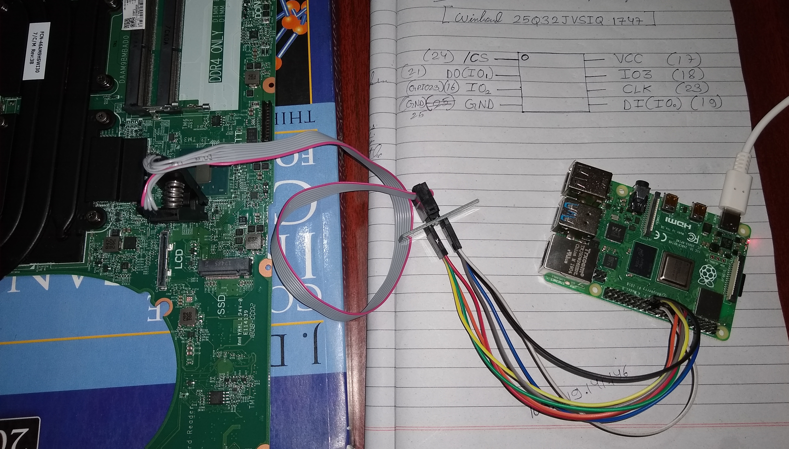
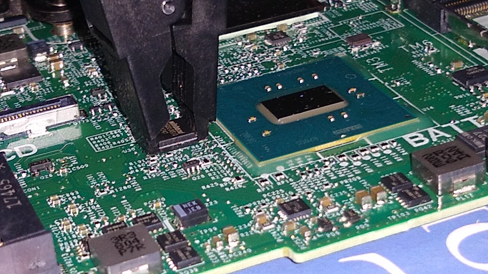

# Disabling Intel ME on Dell Laptop

## Whats is intel ME ?

- [Intel Management Engine](https://en.wikipedia.org/wiki/Intel_Management_Engine) is an autonomous coprocessor which is integrated in all Intel CPUs created after 2006.
- It aims at accessing and controlling the PC over a network even when the main processor is switched off.
- It runs at ring -3 , completely out of the reach of the OS or other low level processes. It is completely independent of the controls of the main CPU.
- It has all memory and network access without the knowledge of the main processor.
- It's active even when the system is switched off or hibernating.
- It allows the sysadmins to take controls of the computer even when it's switched off, remotely over a network. It allows the company (Intel) and other authorized people to track and access your PC (probably when it's stolen or it's being misused). But, possible [vulnerabilities](https://en.wikipedia.org/wiki/Intel_Management_Engine#Security_vulnerabilities) in it's system may allow unauthorized/attackers to [gain access](docs/How-To-Hack-A-Turned-Off-Computer-Or-Running-Unsigned-Code-In-Intel-Management-Engine.pdf) to it and grab a full control of the computer.
- It shares it's flash with the BIOS.
- The main Processor won't start if the ME is not working or broken, ME is required to start the system.

[More Info](docs/Rootkit_in_your_laptop.pdf)

## Can we disable it ?

Yes, it is now possible to disable intel ME, thanks to [NSA](docs/HAP-Challenges.pdf) and [Positive Technologies](https://www.ptsecurity.com/). On the request of NSA, Intel has provided a [kill switch](https://github.com/corna/me_cleaner/wiki/HAP-AltMeDisable-bit) to safely disable ME as it may cause various security issues, which was explored by security researchers at Positive Technologies and now even we can disable ME.
Thankfully, Nicola Corna has developed a script [me_cleaner](https://github.com/corna/me_cleaner) to ease our work of modifying and making changes in the BIOS firmware.

[Read more](http://blog.ptsecurity.com/2017/08/disabling-intel-me.html)

## How to disable it ?

Currently, There are three ways to disable it:

- Some new Dell Laptops have an option to disable ME in in their UEFI settings.
- Enable the HAP (Intel ME >= 11) or the AltMeDisable (Intel ME <= 11) bit in the flash descriptor of the BIOS firmware.
- Removing the non-fundamental partitions and modules of the ME firmware.

[Read more](https://github.com/corna/me_cleaner/wiki/HAP-AltMeDisable-bit)

**This guide would tell you how I disabled ME through External Flashing with modified OEM firmware on my Dell Inspiron 15 5577 gaming laptop and other similar laptops. **

## Steps to Disable ME on Dell Inspiron 15 5577 Gaming

### Important!

**_WARNING_ :**
**The process involved will require re-flashing your system's BIOS-chip firmware image, and will almost certainly void your system warranty. It may result in your machine becoming 'bricked'. On some (though not many) PCs, the ME is used to initialize or manage certain system peripherals and/or provide silicon workarounds — if that is the case on your target machine, you may lose functionality by disabling it. Although the most reliable method, external flashing does require you to open the case of your PC, an action that by itself is likely to void the warranty on non-desktop systems. Always observe proper [ESD protective measures](https://www.computerhope.com/esd.htm) when working with exposed system boards, and ensure that you have all external power sources and batteries removed. Backup any important files before proceeding. Read all instructions carefully and proceed only if you are comfortable, and at your own risk.**

Before proceeding further, I'd recommend to read these stuffs which I followed to understand the process,

- [Get the status of Intel ME](https://github.com/corna/me_cleaner/wiki/Get-the-status-of-Intel-ME) (To check the current status of ME before changing anything)
- [How does it work ?](https://github.com/corna/me_cleaner/wiki/How-does-it-work%3F) (Basic knowledge of what's being done)
- [Nicola Corna's Guide to external flashing](https://github.com/corna/me_cleaner/wiki/External-flashing) (Generic steps through external flashing)
- [Gentoo Wiki's great detailed guide for external flashing](https://wiki.gentoo.org/wiki/Sakaki%27s_EFI_Install_Guide/Disabling_the_Intel_Management_Engine) (The best step by step guide for this process, which I followed)

### Short Description

So, What actually we are going to do? What are the steps?
In short, we're going to read the BIOS firmware from the BIOS Flash IC on the motherboard to a file, we'll verify the firmware read into the file, we'll use [me_cleaner](https://github.com/corna/me_cleaner) to check again and disable Intel ME using either of the two last methods (See [How to disable it ?](#)) and write the modified firmware to a file, then we'll flash (write) the modified firmware with disabled ME back into the IC.

So, The entire process can be divided into the following steps:

 - Check the current status of Intel ME along with information about [Intel Boot Guard](https://en.wikipedia.org/wiki/Intel_vPro#Intel_Boot_Guard).
 - Set up a Raspberry Pi 2/3/4 to be used as a SPI flash programmer
 - Disassemble the laptop and find the BIOS flash IC
 - Setup the connections between BIOS flash IC and Raspberry Pi
 - Read and verify the firmware from the BIOS flash chip
 - Disable the Intel ME into the firmware image file and produce a modified image file
 - Flash the modified firmware image back into the flash chip.
 - Reassemble the laptop
 - Recheck the status of Intel ME
 
**It is highly recommended to go through the [Gentoo wiki](https://wiki.gentoo.org/wiki/Sakaki%27s_EFI_Install_Guide/Disabling_the_Intel_Management_Engine) as it is the more detailed procedure, which guided me along with every precautions and safety to successfully perform this process. **

### Things Required

- SOIC-8 SOP-8 flash chip test clip, to attach it to the 8 pins of the BIOS flash chip to access its contents

- Raspberry PI 2/3/4 (with it's official power adapter), to use it as a SPI flash programmer

- WiFi router or WiFi hotspot, to connect Raspberry PI when it boots
- 8GB microSD card to boot Arch Linux ARM on Raspberry PI
- An empty 8GB(or more) USB flash drive, the pen drive needs to empty as all the data will be lost during the process (for windows users only)
- 8 female to female jumper wires
- Tools to help in disassembly/assembly of the laptop
- A working internet connection
- Another device(laptop/desktop/tablet/smartphone) which can aid you reading the guides, pdfs, text files and lets you run a ssh client.

### Step 1: Check Intel ME status

**For Windows User**:

- Download a latest version of [Kali linux](https://www.kali.org/downloads/) cause it has all essential tools like git, gcc, make, etc to proceed further.
- Use [Rufus](https://rufus.ie/) or [Yumi](https://www.pendrivelinux.com/yumi-multiboot-usb-creator/)  or [Eatcher](https://www.balena.io/etcher/) to install kali iso on a 8GB pen drive.
- After kali is installed on the pen drive, reboot and boot kali from the pen drive, add the kernel parameter `iomem=relaxed` into grub entry 'Live' before booting kali. (When the screen shows the list of booting options, highlight 'Live' option and press 'e' then add the option at the end of line starting with 'linux' and press F10 to boot )
- Connect kali to your wifi router/hotspot to get access to the internet.
- Right click on kali desktop and click on 'open terminal' to open a terminal.
- Run `apt update && apt-get install libpci-dev zlib1g-dev` to install the required packages.
- Now, follow the steps of **Linux** section.

**For Linux User**:

- Install `git`,`gcc`,`make` and development files(header files) for pciutils and zlib if not already installed according to your distribution (kali users skip this).
- Now in the terminal execute these to check for me status:
```bash
$ git clone --depth=1 https://review.coreboot.org/coreboot
$ cd coreboot/util/intelmetool
$ make
$ sudo modprobe msr
$ sudo ./intelmetool -mb
```
The last command shows the status of Intel ME along with Intel Boot Guard.
If the line `Current Working State: Normal` shows 'Normal' then Intel ME is present and active.
To save the status execute :
```bash
$ sudo ./intelmetool -mb > mestatus-1.log
```
(_See [output](/logs/mestatus-before.log)_) )

If the line `ME Capability: BootGuard: ON` shows 'ON' then Intel Boot Guard is on and we can't remove and destroy ME modules but we can disable ME by just setting HAP-bit. 
**If Intel Boot Guard is ON, changing anything else in the firmware may lead to system being unbootable which can not be reversed.**

- Save the `mestatus-1.log` file safely to the device other than this PC.
- Don't close the terminals proceed to the next step for setting up Raspberry Pi as a SPI programmer.

[More Info](https://github.com/corna/me_cleaner/wiki/Get-the-status-of-Intel-ME)

### Step 2: Setup the Raspberry Pi as a SPI programmer

I used Raspberry PI 4B for my setup but you may use any Raspberry PI(2|3|4), you just need to install a linux operating system with SPI devices enabled. Here, we're installing [Arch Linux ARM](https://archlinuxarm.org/).

- Follow the steps to install Arch Linux ARM for your Raspberry Pi board till step 6: [Raspberry Pi 2](https://archlinuxarm.org/platforms/armv7/broadcom/raspberry-pi-2) [Raspberry Pi 3](https://archlinuxarm.org/platforms/armv8/broadcom/raspberry-pi-3) [Raspberry Pi 4](https://archlinuxarm.org/platforms/armv8/broadcom/raspberry-pi-4) 
- Just after 6th step during the process of installation of Arch Linux ARM add the following line to enable SPI devices,
```bash
$ echo 'device_tree_param=spi=on' >> boot/config.txt
```
- After the above step, To make Raspberry Pi automatically join a wifi hotspot on boot do the following:
Create a file `/etc/systemd/network/wlan0.network`by the following by starting a root shell:
```bash
$ sudo bash
$ cat > root/etc/systemd/network/wlan0.network << "EOF"
[Match]
Name=wlan0

[Network]
DHCP=yes
EOF
```
Now, create a file `/etc/wpa_supplicant/wpa_supplicant-wlan0.conf`by the following, replace _SSID_ with your Hotspot's SSID and _PASSWORD_ with your wifi password:
```bash
$ wpa_passphrase "SSID" "PASSWORD" > root/etc/wpa_supplicant/wpa_supplicant-wlan0.conf
```
Then, to set the systemd service to auto connect your wifi hotspot when booting and exit the root shell
```bash
$ ln -svf /usr/lib/systemd/system/wpa_supplicant@.service root/etc/systemd/system/multi-user.target.wants/wpa_supplicant@wlan0.service
$ exit
```
- Now, you can return back to the respective Arch Linux ARM wiki page to continue with the 7th step and skip the part about connecting with ethernet. Instead Turn ON your wifi hotspot before booting Raspberry Pi, and make sure to give internet access through the hotspot. 
**Note: Use the official Raspberry Pi adapter to power the pi. Using an insufficient power supply will result in random, inexplicable errors and filesystem corruption.**

Looking for the ip address of the Raspberry Pi to connect it using ssh is a tedious job. If you use a wifi router then you can go the router settings page through your browser and login to see the connected clients and find out the ip of 'alarmpi'.

However, if you have used other methods then you can install `nmap` on your linux distro (kali users already have nmap installed).
First know your own ip address on the wifi, execute `ip addr`. This will list the interfaces, the interface name starting with 'wlan' or 'wlp' name is wifi interface and the ip address after the word 'inet' is what we're looking for (ex: 192.168.0.142/24).
Now we'll use the ip to probe other devices connected to the network. Just by replacing the last byte of the address with 0 (ex: 192.168.0.142/24 to 192.168.0.0/24) and probing using nmap will fetch the list of connected devices. 
```bash
$ nmap -sn 192.168.0.0/24
```
Now, if you've connected just your laptop and Raspberry Pi connected to the wifi then the ip address other than your ip in the output is the ip  of the pi.
If there are many devices connected on the network, then you can power off the pi and probe using nmap and then power on and again probe using nmap, then simply compare the changes in the output to find out the ip address of the pi.

**If you've got a monitor connected to the Raspberry PI, you're easy to go and you must skip the stuffs about ssh and move to the next step.**
Now, you can login on pi through ssh (install `openssh` if you don't have ssh client installed) if pi's ip is 192.168.0.184 by executing `ssh alarm@192.168.0.184` using password 'alarm'.

- After completing the 10th step on the wiki, update the arch linux and install the required packages, password for root is 'root'.
```bash
$ su root
$ pacman -Syu
$ pacman -S python python-setuptools python-pip flashrom wget git base-devel
$ pip install RPi.GPIO
$ exit
```
To check if raspberry shows SPI devices execute `ls /dev/spidev*`, if the out says 'No such file or directory' then SPI is not enabled else everything is setup and ready for our process.

- Raspberry lacks inbuilt RTC module to keep time even when it's powered off. So, we need to update time in order to make it able to access the internet.
To solve the issue, execute on the first boot while connected to internet:
```bash
$ su root
$ echo "FallbackNTP=$(getent hosts 0.arch.pool.ntp.org | head -n1 | awk '{ print $1 }')" >> /etc/systemd/timesyncd.conf
$ systemctl enable systemd-timesyncd
$ systemctl start systemd-timesyncd
$ exit
```
- Now, you can execute `exit` and exit ssh shell.

### Step 3: Disassemble the Laptop

Make proper backup of all your important files before  opening your laptop. Disconnect and remove the external power cables (and we've to remove the batteries after opening the laptop case as per in the service manual) and all other devices connected to the laptop.

Look for Dell's official service manual guide for your dell laptop and follow the steps carefully to "Remove the System Board", following all the Prerequisites with proper care. You may also download the service manual for Inspiron 15 5577 [here](docs/inspiron-15-5577-gaming-laptop_service-manual_en-us.pdf) .
If you aren't able to find the service manual, you can watch disassembly videos for your model on youtube and may take risk to follow their instructions.
Make sure to disconnect the batteries and CMOS cell from the while performing the disassembly.

**Important Tips**

1. Handle the screws with care while unscrewing or screwing them and after they're removed. You may land into trouble if they get stripped while screwing or unscrewing or if they get lost or mixed with other screws of different type. (If any screw gets stripped or worn while trying to unscrew, you may use a proper T4 to T10 type screwdriver to get a grip in the worn pit of the screw to force rotate and unscrew)
1. Take proper care to prevent [ESD](https://www.computerhope.com/esd.htm) while disassembling the inner parts of the laptop, as electrostatic discharges may damage the inner components.
1. Make sure to place the removed components and the motherboard on a clean and safe place.
1. Handle the boards and components by their edges, avoid touching the components by hands.
 
### Step 4: Setup the Connections

- Now, you've got the motherboard. We'll have to locate the BIOS flash IC. One of the way to find this chip is to look at how it looks like on the board and then use a magnifying glass or a magnifier app on phone to find all such ICs on the board, taking down the model numbers and other texts on them. Then, you can google the texts for each to know if they're a flash chip and if they're used as a BIOS flash chip. For Dell Inspiron 15 5577 the BIOS chip was a SOIC-8 chip 'Winbond 25Q32JVSIQ' as shown in the figure.



- Now, when you've got the exact BIOS flash chip's maker's name and model. We must find out the datasheet to get the complete details about the chip. Google the IC's maker's name and model number to get the datasheet for the IC. For 'Winbond 25Q32JVSIQ' the datasheet can be downloaded from [here](docs/w25q32jv-spi-revc-08302016.pdf).
- Look carefully in the datasheet, for pin configurations of SOIC type and input voltages. You may take time to read which pin does what if you want to make everything sure for your understanding. The circular dot or semi-circular cut on the ICs are used to mark which side is up. The numerical counting of the pins start from the top most left pin and ends at the top most right pin. The diagram shown below shows the 'Winbond 25Q32JVSIQ' IC pins.
- The connections for SPI device on Raspberry Pi is as shown in the diagram. 


| PIN | Pin Name | Description                                                                 |
|:---:|:--------:|-----------------------------------------------------------------------------|
| 1   | /CS      | Chip Select; Drive low to enable the device operations                      |
| 2   | DO(IO1)  | Data Output (Data Input Output 1); Data output from device for Standard SPI |
| 3   | IO2      | Data Input Output 2                                                         |
| 4   | GND      | Ground                                                                      |
| 5   | DI(IO0)  | Data Input (Data Input Output 0); Data input into device for Standard SPI   |
| 6   | CLK      | Serial Clock Input                                                          |
| 7   | IO3      | Data Input Output3                                                          |
| 8   | Vcc      | Power Supply                                                                |
**Mark the SOIC-8 flash chip test clip for the respective pin numbers of the IC to attach to, so that you don't get confused after wiring the clip with Raspberry Pi for which way to attach the clip.**
- We'll have to use the SOIC-8 SOP-8 flash chip test clip to connect the bios flash IC to required Raspberry Pi SPI device pins respectively. Connect the pins of the clip to the Raspberry Pi pins using female to female jumper wires accordingly. Identify all the pins on the IC through its datasheet and look the gpio pin diagram for Raspberry Pi and connect the SOIC-8 clip pins as follows, so that it attaches to the correct pins on the IC after the clip is attached to the IC:



**WARNING :  Be very careful not to connect pins 2 or 4 on the RPi4's GPIO header to any pin of the IC clip - these are 5v (rather then 3.3v) and are likely to destroy your flash chip should you accidentally use them (See the datasheet to know about the appropriate input voltage).**

| SOIC-8 Flash IC Pin | PIN | Raspberry Pi GPIO Pin | PIN |
|:-------------------:|:---:|:---------------------:|:---:|
| Vcc                 | 8   | 3.3v                  | 17  |
| GND                 | 4   | Ground                | 25  |
| /CS                 | 1   | SPI0_CE0_N            | 24  |
| CLK                 | 6   | SPI_CLK               | 23  |
| DO                  | 2   | SPI_MISO              | 21  |
| DI                  | 5   | SPI_MOSI              | 19  |
| /WP (IO2)           | 3   | GPIO_GEN4             | 16  |
| /HOLD (IO3)         | 7   | GPIO_GEN5             | 18  |
**Note**: Don't attach the clip to the IC right now because it won't work.

- Now, make sure your wifi router/hotspot is turned on, supply power to turn on the Raspberry Pi. It should automatically connect to the wifi while booting. If you've got a monitor attached to the raspberry pi, you're easy to go, you can just login. However, if you don't have a monitor then we can access the Raspberry Pi's shell through ssh. If you've another PC or MAC, you can connect it to the same wifi and use an appropriate ssh client for the operating system to connect to the Raspberry Pi. If you don't have another PC but you've an android smartphone or tablet, you can still access the Raspberry Pi through ssh, connect the phone/tablet to the same wifi network(if your wifi hotspot is from the same phone/tablet, you're already on the same network) just install the Termux app from the the [Play store](https://play.google.com/store/apps/details?id=com.termux) or [F-Droid](https://f-droid.org/repository/browse/?fdid=com.termux) and install openssh and nmap packages on termux; `pkg install openssh nmap`(Refer Step 2 to probe Pi's ip address and connect using ssh).
- Once you've got access to the Raspberry Pi's shell, get root login and make sure the internet works.
```bash
$ su --login root
$ ping -c 4 archlinux.org
```
- Now, We need to pull-up the gpio pins 16 and 18 on the Raspberry Pi. I've created the following script for this purpose. However, you can do this using `wiringpi` package's `gpio` tool for Pi 2 or 3. But, `wiringpi` fails for Pi 4 and its development seems to have stopped. Fortunately, the python library `RPi.GPIO` works on all three.
```bash
$ wget https://raw.githubusercontent.com/darajnish/dell5577medisable/master/scripts/gpio.py
$ python gpio.py 
```
It should output the current value read from the pins 23 and 24 be set to **1**.




- Now, taking precautions to prevent [ESD](https://www.computerhope.com/esd.htm) and ensuring proper alignment of the clip with respect to the IC pins, carefully attach the IC clip to the IC and check if it is detected by `flashrom`.
```bash
$ flashrom -p linux_spi:dev=/dev/spidev0.0,spispeed=8000
```
The output should be something like,
```
flashrom v1.1 on Linux 4.19.67-1-ARCH (armv7l)
flashrom is free software, get the source code at https://flashrom.org

Using clock_gettime for delay loops (clk_id: 1, resolution: 1ns).
Found Winbond flash chip "W25Q32.V" (4096 kB, SPI) on linux_spi.
No operations were specified.
```
( _See [output](/logs/identification.log)_ )
But, if you get `No EEPROM/flash device found` then recheck the connections and alignment of the clip with the IC; remove and reattach the IC and repeat the above command until it gets detected.

**WARNING: If flashrom reports that it has found a brand or make of chip that doesn't match what you expected, stop. Search online and only proceed if you are confident there is no ambiguity.**

### Step 5: Read and Verify Firmware

- Once the chip gets detected by flashrom, we can proceed to read the firmware. Read the firmware image by the following command (we'll read 3 copies),
```bash
$ flashrom -p linux_spi:dev=/dev/spidev0.0,spispeed=8000 -r original.rom
$ flashrom -p linux_spi:dev=/dev/spidev0.0,spispeed=8000 -r original2.rom
$ flashrom -p linux_spi:dev=/dev/spidev0.0,spispeed=8000 -r original3.rom
```
Output should be something like,
```
flashrom v1.1 on Linux 4.19.67-1-ARCH (armv7l)
flashrom is free software, get the source code at https://flashrom.org

Using clock_gettime for delay loops (clk_id: 1, resolution: 1ns).
Found Winbond flash chip "W25Q32.V" (4096 kB, SPI) on linux_spi.
Reading flash... done.
```
( _See [output](/logs/reading.log)_ )

- Now, we must verify if the read data is identical for all the three files. We can do so by checking the integrity of the read files using `md5sum`.
```bash
$ md5sum original*
```
**WARNING: The hashes of the checksum of all the three should be identical. If any one of them is different then read the firmware again and again until the image files are identical. Make sure the IC clip is attached properly. You can reduce(adjust) the `spispeed=` parameter value to what is given in the datasheet.**

- Verify the structure of the firmware image,
```bash
$ git clone --depth=1 https://review.coreboot.org/coreboot
$ cd coreboot/util/ifdtool
$ make
$ cd ../../..
$ ./coreboot/util/ifdtool/ifdtool -d original.rom
```
You should get output something like [this](/logs/ifdtoollog-original-rom.log) .
**WARNING: If ifdtool -d reports an error, or states that No Flash Descriptor found in this image, stop. Repeat the read process until you have the identical copies and this ifdtool -d check.**

Check if `me_cleaner` tool understands this image,
```bash
$ git clone https://github.com/corna/me_cleaner
$ python me_cleaner/me_cleaner.py --check original.rom
```
See [output](/logs/me_cleaner-check.log).


- When the images read are identical, we can proceed to modify and disable Intel ME in the firmware file.

### Step 6: Modify the Firmware image

- You can disable Intel ME in two ways, you can choose either of these :
    1. **soft-disable**:  It both removes the uneeded ME firmware and sets the AltMeDisable/HAP bit. **You can do this one only if you don't have Intel Boot Guard enabled.**
```bash
$ python me_cleaner/me_cleaner.py --soft-disable original.rom --output modified.rom
```
    2. **soft-disable-only**(recommended): It only sets the AltMeDisable/HAP bit. **You must go for this if you've Intel Boot Guard enabled.**
```bash
$ python me_cleaner/me_cleaner.py --soft-disable-only original.rom --output modified.rom
```
See [output](/logs/me_cleaner-soft-disable-only.log) (for soft-disable-only)

- Now, check the modified image file,
```bash
$ python me_cleaner/me_cleaner.py --check modified.rom
```
It shows `The HAP bit is SET` in the [output](/logs/me_cleaner-after-check.log).

### Step 7: Write the modified Firmware

- Write the modified firmware into the BIOS flash IC,
```bash
$ flashrom -p linux_spi:dev=/dev/spidev0.0,spispeed=8000 -w modified.rom
```
flashrom should show output something like,
```
flashrom v1.1 on Linux 4.19.67-1-ARCH (armv7l)
flashrom is free software, get the source code at https://flashrom.org

Using clock_gettime for delay loops (clk_id: 1, resolution: 1ns).
Found Winbond flash chip "W25Q32.V" (4096 kB, SPI) on linux_spi.
Reading old flash chip contents... done.
Erasing and writing flash chip... Erase/write done.
Verifying flash... VERIFIED.
```
( _See [output](/logs/writing.log)_ )

**WARNING: If flashrom reports an error here, or does not finish with the output `Verifying flash... VERIFIED`, stop. You almost surely have a corrupted flash. Try the write again, using a slower spispeed parameter, and if that also fails, try re-seating the IC clip on the IC.**

### Step 8: Reassemble the Laptop

If everything works without any error, then reassemble your laptop. Follow the procedure for "Replacing System Board" in the Dell Service manual. Power on the laptop. If it boots successfully, wait for 30 minutes to check if it auto shutdowns. 
If it doesn't auto shutdowns and everything works fine then congratulations you've disabled Intel ME.
[Report](https://github.com/corna/me_cleaner/issues/3) your logs, system info and problems so that someone else may find it useful.

####  If Boot fails or the PC shuts down unexpectedly
**WARNING: If it fails to boot or shutdowns unexpectedly then we must revert the original firmware back into the BIOS flash chip. Again Disassemble the laptop taking all safety precautions and write the file `original.rom` back into the BIOS flash chip**

- Disassemble the laptop again
- Setup the connections for IC clip and Raspberry Pi.
- Attach the IC clip on the flash IC properly and write the original firmware image back into the IC.
```bash
$ python gpio.py
$ flashrom -p linux_spi:dev=/dev/spidev0.0,spispeed=8000 -w original.rom
```
- Now, reassemble the laptop and get it back in previous state.
- You can report about the problem [here](https://github.com/corna/me_cleaner/issues/new).

### Step 9: Recheck status of Intel ME

Follow Step 1 and check the status of ME again.
It should be disabled.

## Concluding

I hope this article helps anybody who is seeking for information about Intel ME and the steps to disabling it. Feel Free to create an issue regarding any queries or doubt about any step of the process.
I'm thankful to the Nicola Corna for me_cleaner and the basic wiki, and to Gentoo wiki which guided me through the entire process.
